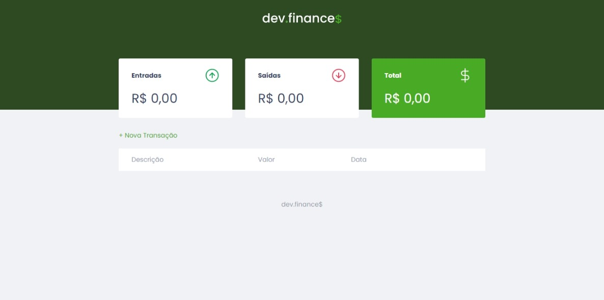
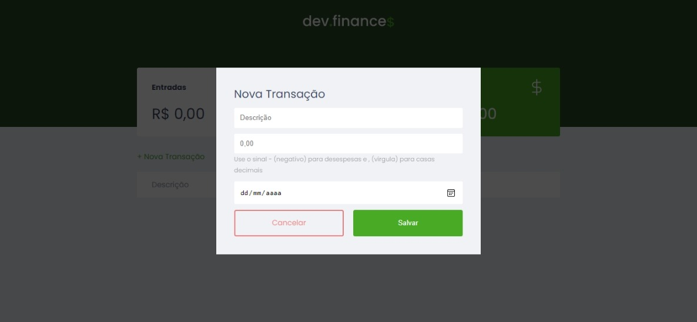
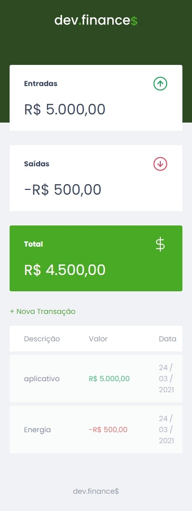

<h1 align="center">Dev Finances</h1>

<h4 align="center"> 
	🚧  Dev Finances 🚀 Concluído  🚧
</h4>

<p align="center">
 <a href="#sobre">Sobre o projeto</a> •
 <a href="#tecnologias">Tecnologias</a> • 
  <a href="#comoexecutar">Como Executar</a> • 
  <a href="#layout">Layout</a> • 
 <a href="#autor">Autor</a>
</p>

<a id="sobre"></a>
## Sobre o projeto
Dev Finances - é uma plataforma que auxilia as pessoas com sua contabilidade, na qual se pode adicionar gastos e ganhos e obter um total de acordo com esses valores.

Projeto desenvolvido durante a Maratona Discover oferecida pela Rocketseat. A Maratona Discover é uma experiência online com muito conteúdo prático, desafios e hacks onde o conteúdo fica disponível durante uma semana.

---
<a id="tecnologias"></a>
### 🛠 Tecnologias

As seguintes ferramentas foram usadas na construção do projeto:

- [HTML](https://developer.mozilla.org/pt-BR/docs/Web/HTML)
- [CSS](https://developer.mozilla.org/pt-BR/docs/Web/CSS)
- [JavaScript](https://developer.mozilla.org/pt-BR/docs/Web/JavaScript)

---
<a id="comoexecutar"></a>
## 🚀 Como executar o projeto


```bash

# Clone este repositório
$ git clone https://github.com/ViniciusAMatos/Dev-Finances.git

# Acesse a pasta do projeto no seu terminal/cmd
$ cd Dev-Finances

# Abra o arquivo index.html


```
---

<a id="layout"></a>
## 🎨 Layout

<h1 align="center"></h1>

<h1 align="center"></h1>

<h1 align="center"></h1>

<h1 align="center"></h1>


<a id="autor"></a>
## Autor


 

Feito com ❤️ por Vinicius André 👋🏽 Entre em contato!

[](https://www.linkedin.com/in/vinicius-andre-6894a4198/) 
[](mailto:14viniciusandre@gmail.com)
